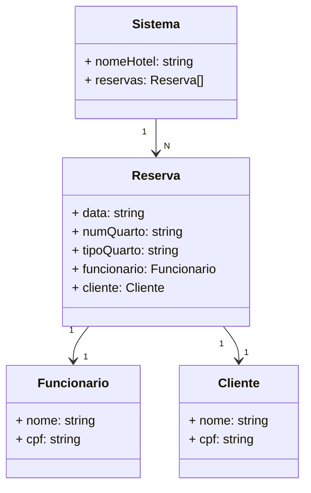

# Desafio-Final-Java-Backend
Teste Desafio Final Backend java DIO

## Diagrama de classes

```mermaid
classDiagram
  class Sistema {
    + nomeHotel: string
    + reservas: Reserva[]
  }

  class Reserva {
    + data: string
    + numQuarto: string
    + tipoQuarto: string
    + funcionario: Funcionario
    + cliente: Cliente
  }

  class Funcionario {
    + nome: string
    + cpf: string
  }

  class Cliente {
    + nome: string
    + cpf: string
  }

  Sistema "1" --> "N" Reserva
  Reserva "1" --> "1" Funcionario
  Reserva "1" --> "1" Cliente

```
